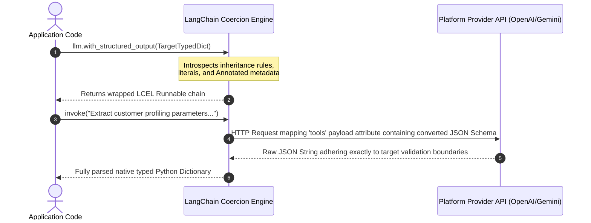

# 🧩 LangChain Structured Output & Type Coercion Master Guide
*A definitive reference manual mapping functional runtime schema generation, standard Python static typing architectures (`TypedDict`, `Annotated`), and base model function-calling enforcement parameters.*

---

## ⚙️ 1. The OpenAPI JSON Schema Coercion Engine

The `.with_structured_output()` interface automates the translation of standard Python data models into strict OpenAPI JSON Schema specifications. These definitions are passed directly to the model's native API layer (such as OpenAI's tool-calling interface or Gemini's structured response protocol) to guarantee output determinism.



---

## 🏗️ 2. Core Schema Construction Archetypes

LangChain accepts three primary declaration formats to synthesize target JSON schemas:

| Schema Target Engine | Runtime Introspection Engine | Native Runtime Output Payload | Optimal Software Engineering Target |
| :--- | :--- | :--- | :--- |
| **`TypedDict`** | Python `typing` standard libraries. | Native Python dictionary. | High performance applications preferring pure dictionary processing. |
| **Pydantic `BaseModel`** | Native internal fields schemas. | Class instantiated entity. | Complex microservices requiring deep validation blocks. |
| **Raw JSON Schema** | Direct dictionary evaluation. | Native Python dictionary. | Dynamic client UI form integrations. |

---

## 📐 3. Mastering `TypedDict` and Inheritance

A standard dictionary (`{}`) offers zero static guarantees. Subclassing `TypedDict` enables robust design contracts:

```python
from typing import TypedDict, NotRequired, Literal

class SystemLogBounds(TypedDict):
    timestamp: str
    severity: Literal["DEBUG", "INFO", "WARN", "ERROR"]
    stack_trace: NotRequired[str]
```

```mermaid
graph TD
    classDef default fill:#0f172a,stroke:#38bdf8,stroke-width:2px,color:#fff;
    classDef base fill:#1e293b,stroke:#cbd5e1,stroke-width:1px,color:#fff;

    Base["typing.TypedDict (Standard Mapping Contract)"] ::: base
    Base --> Child["SystemLogBounds (Static Verified Blueprint)"]
    Child --> Required["Mandatory Attributes: timestamp, severity"] ::: base
    Child --> Optional["Optional Attributes: NotRequired[stack_trace]"] ::: base
```

---

## 🏷️ 4. Enhancing Attention via `Annotated` Metadata

Pure static types (`age: int`) fail to instruct the attention heads of language models on contextual boundaries. Wrapping signatures with `Annotated` injects precise semantic descriptions directly into the generated JSON Schema properties:

```python
from typing import Annotated, List

class ExtractionProfile(TypedDict):
    full_name: Annotated[str, "The formal capital case entity identifier string."]
    risk_factors: Annotated[List[str], "Array of specific threat vectors extracted from context."]
```

### 🧠 Semantic Pipeline Impact:
1. **Model Injection**: The description string binds directly to the OpenAPI field property node.
2. **Hallucination Suppression**: Restricts model sampling to fit explicit boundaries instead of generic interpolation parameters.

---

## 🚀 5. Advanced Production Patterns

### 🔀 1. Action Routing Decoupling
Map conditional outputs to guide subsequent execution paths dynamically.

```python
class AgentRouterIntent(TypedDict):
    destination: Annotated[Literal["SQL_DB", "VECTOR_SPACE", "LIVE_API"], "Target data connector."]
    optimized_query: Annotated[str, "The synthesized downstream query parameter string."]
```

### 🧠 2. Chain-of-Thought Enforced Tracing
Forces the attention layer to externalize reasoning steps sequentially before outputting final targets. Prevents single-pass arithmetic generation failures.

```python
class VerifiedMathSolution(TypedDict):
    reasoning_steps: Annotated[List[str], "Sequential mathematical validation proofs."]
    final_output: Annotated[float, "Calculated terminal scalar return value."]
```

---

## 📁 6. Executable Workspace Syllabus Reference
Inspect the execution scripts inside this directory to study working structured extraction pipelines:
- `typeddict_demo.py` / `pydantic_demo.py`: Core blueprint validation comparisons.
- `with_structured_output_json.py`: Legacy direct dict string parsing.
- `with_structured_output_pydantic.py`: Instantiating robust validation models.
- `with_structured_output_typeddict.py`: High-speed native framework coercions.
- `example_new_01_include_raw.py`: Preserving upstream messaging payloads alongside parsed dict outputs.
- `example_new_02_strict_mode.py`: Forcing strict JSON structure compilation validation bounds.
