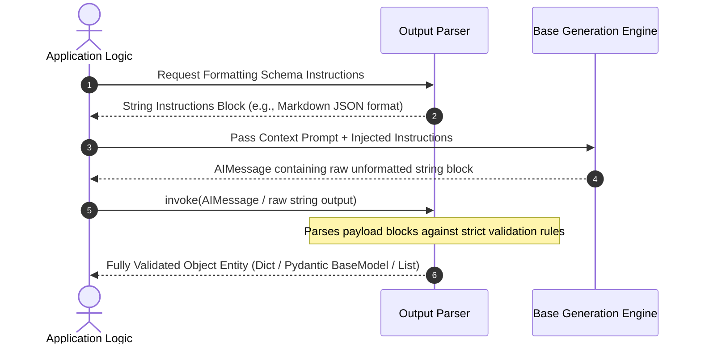

# 🛠️ LangChain Output Parsers: Structural Data Extraction Guide
*A production reference architecture mapping raw string model predictions to typed program structures, automated schema instructions injection, and dynamic syntax correction engines.*

---

## 🔄 1. The Output Parsing Lifecycle

Output Parsers resolve a fundamental boundary problem: bridging probabilistic string generation models with deterministic, typed object code systems.



---

## 🏛️ 2. Core Parser Categories: Functional Matrix

| Parser Interface Class | Injection Instruction Output | Final Validated Payload Type | Production Intended Use Case |
| :--- | :--- | :--- | :--- |
| **`StrOutputParser`** | None (Invisible pass-through). | Clean plain text string. | Chatbots; simple prose translation blocks. |
| **`JsonOutputParser`** | JSON markdown code block requests. | Native Python Dictionary. | Arbitrary unstructured/semi-structured attributes. |
| **`StructuredOutputParser`** | Customized `ResponseSchema` rules. | Typed nested dictionary. | Strict dict parsing interfaces without Pydantic dependencies. |
| **`PydanticOutputParser`** | Full explicit model fields schema. | Initialized `BaseModel` instance. | Highly typed critical downstream API systems. |

---

## 🧩 3. Pydantic Architecture vs. Core Interfaces

### 📦 Core Parsers (`langchain-core` native)
Handle direct structural string processing without enforcing complex object type bounds. Extremely fast and lightweight.

### 🛡️ Pydantic Output Parsers
Leverage deep runtime typing integrations. If a model emits `"age": "twenty"` instead of an integer, the internal validation layer instantly traps the exception to prevent data pollution across persistent datastores.

---

## ⚡ 4. Specialized Niche Data Parsers

```mermaid
graph TD
    classDef default fill:#0f172a,stroke:#38bdf8,stroke-width:2px,color:#fff;
    classDef child fill:#1e293b,stroke:#cbd5e1,stroke-width:1px,color:#fff;

    Root["Specialized Interface Implementations"]
    
    Root --> List["CommaSeparatedListOutputParser"] ::: child
    List --> ListOut["Output: Python List Array"] ::: child
    
    Root --> Date["DatetimeOutputParser"] ::: child
    Date --> DateOut["Output: datetime.datetime entity"] ::: child
    
    Root --> XML["XMLOutputParser"] ::: child
    XML --> XMLOut["Output: Nested Dict Tag Trees"] ::: child
    
    Root --> Enum["EnumOutputParser"] ::: child
    Enum --> EnumOut["Output: Validated Enum instance value"] ::: child
```

---

## 🛡️ 5. Resilient Auto-Fixing Systems: Dynamic Correction Loops

When generation sequences drift due to contextual noise or truncation, raw syntax might fail validation checking. LangChain implements autonomous self-correcting fallback wrappers to resolve broken outputs without developer intervention:

### 🔧 1. `OutputFixingParser`
Passes broken string payloads back to a separate auxiliary correction model engine alongside full exception traceback descriptions, asking it to repair trailing commas or missing closing brackets cleanly.

```mermaid
graph LR
    classDef fail fill:#7f1d1d,stroke:#fca5a5,stroke-width:2px,color:#fff;
    classDef fix fill:#312e81,stroke:#a5b4fc,stroke-width:2px,color:#fff;
    classDef success fill:#022c22,stroke:#34d399,stroke-width:2px,color:#fff;

    Raw["Malformed Generation String"] --> Verify{"Validation Pass?"}
    Verify -- Success --> Output["Valid Typed Entity"] ::: success
    Verify -- Throw Error --> Fixer["OutputFixingParser (Correction Model LLM)"] ::: fail
    Fixer --> Output ::: fix
```

### 🔄 2. `RetryOutputParser`
Feeds the original full system prompt alongside the failed string response back to the core generation engine, forcing it to recalibrate generation parameters iteratively.

---

## 📁 6. Executable Reference Scripts
Review the numbered demonstration scripts directly in this path to verify operational behavior:
- `example_01_str_output_parser.py`: Foundational direct string extraction pipelines.
- `example_02_json_output_parser.py`: Injecting standard JSON formatting constraints.
- `example_03_structured_output_parser.py`: Using explicit dictionary schema mappings.
- `example_04_pydantic_output_parser.py`: Instantiating fully typed validation entities.
- `example_05_list_output_parser.py`: Extracting arrays from textual lists.
- `example_06_datetime_output_parser.py`: Forcing strict timestamp output standards.
