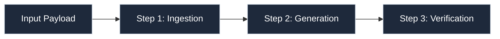
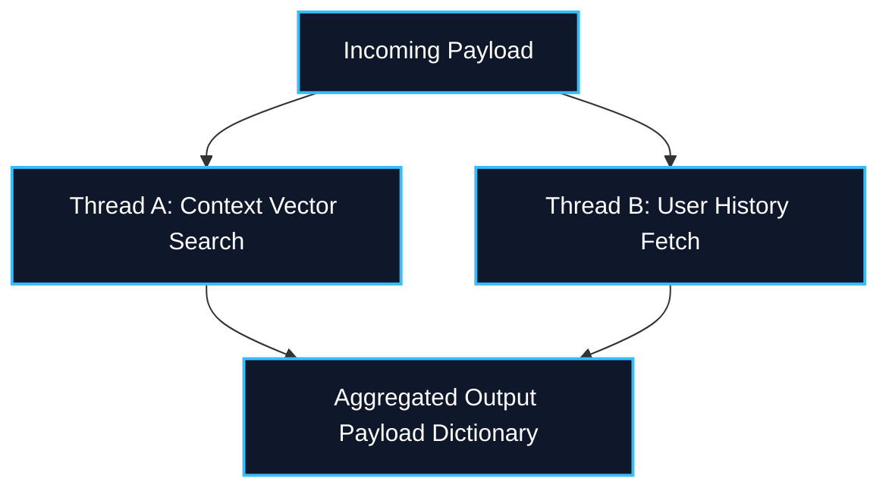

# ⛓️ LangChain Chains, LCEL Engine, & Runnables Master Guide
*A definitive visual reference mapping classic procedural Chain architectures against modern declarative LangChain Expression Language (LCEL) workflows and core `Runnable` interface abstractions.*

---

## 🏛️ 1. Taxonomy of Application Components

Production Generative AI workflows separate distinct cognitive, formatting, and networking phases into highly reusable modular blocks:

```mermaid
graph LR
    classDef in fill:#0f172a,stroke:#38bdf8,stroke-width:2px,color:#fff;
    classDef mid fill:#1e293b,stroke:#cbd5e1,stroke-width:1px,color:#fff;
    classDef out fill:#022c22,stroke:#34d399,stroke-width:2px,color:#fff;

    Input["User Dict Payload"] ::: in --> Prompt["PromptTemplate Engine"] ::: mid
    Prompt --> Model["Chat Model Engine"] ::: mid
    Model --> Parser["Output Parser Engine"] ::: out
    Parser --> Result["Structured Final Entity"] ::: in
```

---

## ⚡ 2. Classic Procedural Chains vs. Declarative LCEL

### 📜 Classic Chains (Legacy Paradigm)
Historically built using dedicated stateful procedural wrapper classes (`LLMChain`, `SequentialChain`). While intuitive, they obscured background asynchronous threading capabilities and restricted batch streaming.

### 🚀 Modern LCEL Pipelines
Declarative pipeline definition strings leveraging the overloaded Python Unix pipe operator (`|`). 

```python
# Declarative Assembly Pipeline Syntax
chain = base_prompt | target_chat_model | pydantic_output_parser
```

---

## 🧩 3. Core Abstraction: The `Runnable` Protocol

Any element capable of participating in an LCEL graph implements the foundational `Runnable` base protocol interface. This exposes predictable execution targets automatically:

| Protocol Method | Execution Behavior | Target Operational Use Case |
| :--- | :--- | :--- |
| **`.invoke()`** | Synchronously transforms a single input payload. | Standard real-time conversational processing calls. |
| **`.stream()`** | Asynchronously yields generated output chunks iteratively. | Low-latency client web application UIs. |
| **`.batch()`** | Executes arrays of independent input structures concurrently. | High-throughput offline document analysis pipelines. |

---

## 📊 4. Structural Primitives: Visual Graph Architectures

### 🔗 1. Sequential Chaining (`RunnableSequence`)
Automatically constructed when chaining components sequentially via the `|` delimiter.



### 🔀 2. Concurrent Branching (`RunnableParallel` / `RunnableMap`)
Executes parallel upstream runnables synchronously before aggregating return values into a single dictionary mapping output.



### 🛤️ 3. Conditional Graph Routing (`RunnableBranch`)
Evaluates deterministic boolean logic predicates dynamically to route intermediate values down specialized execution tracks.

```mermaid
graph TD
    classDef route fill:#312e81,stroke:#a5b4fc,stroke-width:2px,color:#fff;
    Eval{"Is Query Code Related?"} ::: route
    Eval -- Yes --> CodeTrack["Execute Technical Syntax Generation Graph"]
    Eval -- No --> TextTrack["Execute Natural Prose Generation Graph"]
```

---

## 🛠️ 5. Advanced Pipeline Transformations

### 📥 1. `.assign()`
Appends generated properties directly onto active intermediate dictionaries without stripping out upstream key attributes. Extremely vital for preserving global session state tracking.

### ⚙️ 2. `.bind()`
Attaches strict parameter bounds (e.g., specific stop sequence strings, forced tool calls arrays, execution temperature overrides) directly to a target model instance at execution runtime.

### 🛡️ 3. `.with_fallbacks()`
Ensures fault-tolerant application logic. If primary upstream layers throw exceptions (API connection failures, rate limiter block triggers), downstream graph routing shifts instantly to defined backup nodes.

```mermaid
graph LR
    classDef fail fill:#7f1d1d,stroke:#fca5a5,stroke-width:2px,color:#fff;
    classDef safe fill:#022c22,stroke:#34d399,stroke-width:2px,color:#fff;

    Main["Primary LLM Engine"] ::: fail -- Rate Limit Trigger --> Fallback["Backup Local Quantized Engine"] ::: safe
```

---

## 📁 6. Executable Script Syllabus Reference
To test live implementation workflows, inspect the numbered scripts included in this folder:
- `example_01_simple_chain.py`: Foundational direct LCEL string constructions.
- `example_02_sequential_chain.py`: Passing stateful payload maps along discrete function sequences.
- `example_03_parallel_chain.py`: Harnessing multi-threaded pipeline dictionary aggregation targets.
- `example_04_conditional_chain.py`: Evaluating declarative dynamic graph routing switches.
- `example_05_runnable_primitives.py`: Manual Lambda injection and pass-through interfaces.
- `example_06_runnable_assign.py`: Maintaining pristine contextual execution continuity buffers.
- `example_07_runnable_bind.py`: Forcing external arguments configurations dynamically.
- `example_08_runnable_fallbacks.py`: Building highly robust enterprise exception handling circuits.
