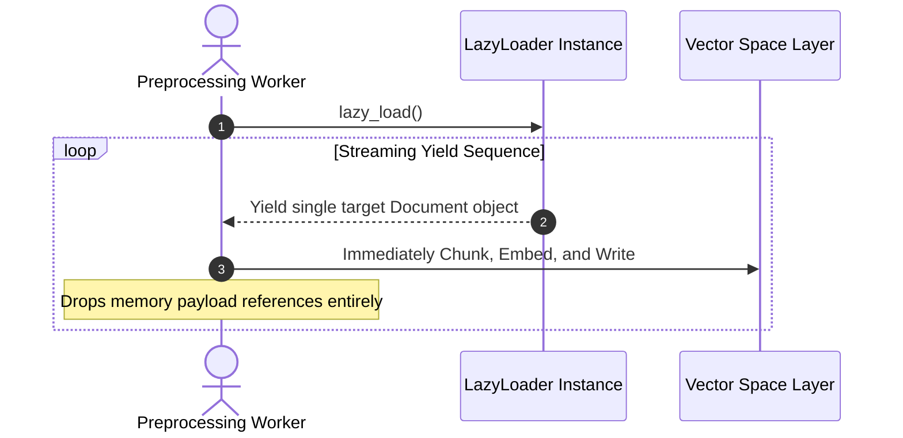

# 📚 LangChain RAG Ingestion Pipeline & Document Loaders Master Guide
*A professional reference manual detailing end-to-end knowledge ingestion, architectural Document schema layouts, high-performance chunk streaming (`.lazy_load()`), and cross-format extraction limits.*

---

## 🔄 1. The Core RAG Ingestion Architecture

Retrieval-Augmented Generation relies on converting unstructured textual strings into normalized `Document` stream payloads capable of dynamic semantic compression.

```mermaid
graph TD
    classDef source fill:#0f172a,stroke:#38bdf8,stroke-width:2px,color:#fff;
    classDef loader fill:#1e293b,stroke:#cbd5e1,stroke-width:1px,color:#fff;
    classDef chunk fill:#312e81,stroke:#a5b4fc,stroke-width:2px,color:#fff;
    classDef db fill:#022c22,stroke:#34d399,stroke-width:2px,color:#fff;

    subgraph Phase 1: Unstructured Acquisition
        S1["PDF Files"] ::: source
        S2["Web URIs"] ::: source
        S3["CSV Arrays"] ::: source
    end
    
    subgraph Phase 2: Structural Wrapping
        L["Target DocumentLoaders"] ::: loader
        Doc["Document Objects: page_content + metadata"] ::: loader
    end
    
    subgraph Phase 3: Spatial Splitting
        Split["TextSplitter Engines"] ::: chunk
        Chunks["Optimized Token Slices"] ::: chunk
    end
    
    subgraph Phase 4: Dense Vector Transformation
        Embed["Embedding Transformer Vectors"] ::: db
        Store["Vector Database Storage Matrix"] ::: db
    end

    S1 --> L
    S2 --> L
    S3 --> L
    L --> Doc
    Doc --> Split
    Split --> Chunks
    Chunks --> Embed
    Embed --> Store
```

---

## 🏛️ 2. The Core `Document` Class Blueprint

Every operational Document Loader yields standardized instances of the fundamental `Document` envelope structure. This guarantees downstream runnables can execute type transformations regardless of file origin.

```mermaid
graph LR
    classDef default fill:#1e293b,stroke:#cbd5e1,stroke-width:1px,color:#fff;
    classDef text fill:#0f172a,stroke:#38bdf8,stroke-width:2px,color:#fff;
    classDef meta fill:#022c22,stroke:#34d399,stroke-width:2px,color:#fff;

    Root["langchain_core.documents.Document"]
    
    Root --> Content["1. page_content"] ::: text
    Content --> StringLiteral["Pure plaintext string literal content extracted from source."] ::: text
    
    Root --> Metadata["2. metadata"] ::: meta
    Metadata --> SourceKey["'source': '/path/to/file.pdf'"] ::: meta
    Metadata --> PageKey["'page': 12"] ::: meta
```

---

## ⚡ 3. Memory Optimization: Eager Loading vs. Lazy Loading

### 📥 1. Eager Loading (`.load()`)
Synchronously processes the complete target path, loading all textual contents directly into flat system memory arrays. Catastrophic for single-node deployments analyzing multi-gigabyte source archives.

### 🌊 2. Streaming Batch Generation (`.lazy_load()`)
Returns asynchronous Python Iterator yields. Downstream code pipelines ingest, split, embed, and dump incremental single documents sequentially directly to storage matrices before triggering memory garbage collection buffers.



---

## 📑 4. Comprehensive Extraction Loaders Reference Matrix

| Loader Implementation Class | Input Media Targets | Metadata Fidelity Extraction | Structural Constraints & Failure Paths |
| :--- | :--- | :--- | :--- |
| **`TextLoader`** | Pure Text (`.txt`, `.md`) | File path. | Zero layout awareness. |
| **`PyPDFLoader`** | Native structural PDFs | File path + Page integer index. | Silent empty strings on flattened/scanned image layers. |
| **`WebBaseLoader`** | Public Web URIs | HTTP Status, Source link, Title. | Bypasses Client-Side rendered JS payloads entirely. |
| **`CSVLoader`** | Tabular records (`.csv`) | Row integer index + user `source_column`. | Explodes token sums if row string combinations exceed context parameters. |
| **`DirectoryLoader`** | Multi-file absolute directory trees | Aggregated downstream child maps. | Demands explicit glob mappings to prevent random parsing errors. |

---

## 📁 5. Executable Script Syllabus Reference
To test live knowledge ingestion, execute files inside this path directly:
- `01_rag_and_chunking.py`: Basic plaintext string splits and structural encapsulation.
- `02_pdf_loader_pro.py`: Complex page iterations tracking internal string metadata buffers.
- `03_webbase_loader_pro.py`: Asynchronous web page HTML extraction paths.
- `04_csv_loader_pro.py`: Row isolation mapping using structural dictionary keys.
- `05_directory_lazy_loading.py`: Building high-throughput iterator memory circuits.
- `06_custom_loader_demo.py` / `07_custom_loader.py`: Overriding iterator sequences cleanly.
- `08_chrome_extension_backend.py`: Conceptual web browser query endpoints.
