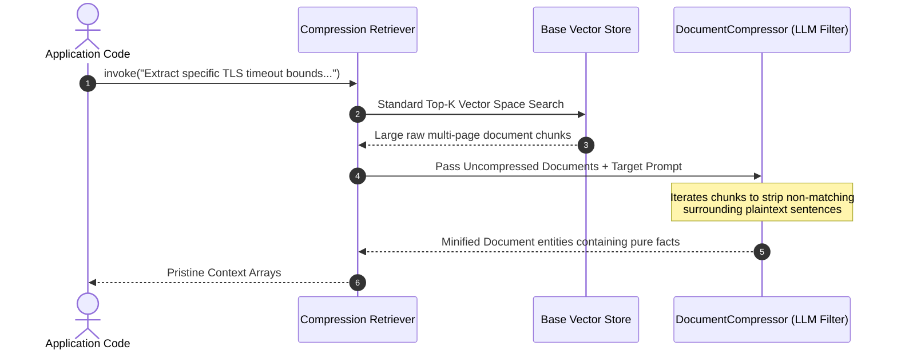

# 🔍 LangChain Advanced Retrieval Architectures Master Guide
*A professional reference manual detailing algorithmic query expansion (`MultiQueryRetriever`), contextual noise compression engines, Reciprocal Rank Fusion hybrid indexing (`EnsembleRetriever`), and structural Parent Document storage layers.*

---

## 🔄 1. The Multi-Query Expansion Architecture

Standard retrieval relies on a single raw user string query. If the input phrasing exhibits low cosine overlap with target documentation, retrieval fails instantly.

The **`MultiQueryRetriever`** routes initial queries through an expansion LLM to generate multiple semantic alternatives, parallelizing vector space searches to maximize overall retrieval recall bounds:

```mermaid
graph TD
    classDef base fill:#0f172a,stroke:#38bdf8,stroke-width:2px,color:#fff;
    classDef step fill:#1e293b,stroke:#cbd5e1,stroke-width:1px,color:#fff;
    classDef merge fill:#022c22,stroke:#34d399,stroke-width:2px,color:#fff;

    Q["Raw User Input Query"] ::: base --> LLM["Query Expansion LLM Layer"] ::: step
    LLM --> V1["Generated Alternative 1"] ::: step
    LLM --> V2["Generated Alternative 2"] ::: step
    LLM --> V3["Generated Alternative 3"] ::: step
    
    V1 --> Search["Parallel Database Vector Searches"] ::: step
    V2 --> Search
    V3 --> Search
    
    Search --> Dedupe["Document Deduplication Engine"] ::: merge
    Dedupe --> Output["Aggregated High-Recall Document Array"] ::: base
```

---

## 🗜️ 2. Contextual Compression Engines

Retrievers often fetch massive documentation chunks containing tiny relevant facts hidden within thousands of surrounding irrelevant noise tokens. 

The **`ContextualCompressionRetriever`** wraps base vector queries with an auxiliary `DocumentCompressor` engine, filtering out extraneous line entries prior to final synthesis window injection:



---

## 🤝 3. Hybrid Search: Dense Vectors vs. Sparse BM25

Pure dense semantic embeddings resolve conceptual similarities beautifully but fail to capture exact alphanumeric technical keywords (such as `CVE-2023-4412` or `user_id_0089`).

The **`EnsembleRetriever`** combines dense transformer coordinate spaces with sparse token statistical frequency scoring (BM25), aggregating distinct relevance metrics utilizing **Reciprocal Rank Fusion (RRF)**:

```mermaid
graph LR
    classDef default fill:#1e293b,stroke:#cbd5e1,stroke-width:1px,color:#fff;
    classDef hybrid fill:#312e81,stroke:#a5b4fc,stroke-width:2px,color:#fff;

    Query["Search Target String"] --> Dense["Dense Storage Search<br/>(Cosine Semantic Meaning)"]
    Query --> Sparse["Sparse Storage Search<br/>(BM25 Exact Keyword Match)"]
    
    Dense --> RRF["Reciprocal Rank Fusion (RRF) Engine"] ::: hybrid
    Sparse --> RRF
    RRF --> Output["Optimized Mixed-Relevance Document Array"]
```

---

## 🗺️ 4. Parent Document Storage Layer

Optimizing vector search requires small chunk parameters (`~256 tokens`) to guarantee accurate cosine positioning. However, language models require surrounding premise contexts to reason correctly.

The **`ParentDocumentRetriever`** decouples extraction layers by storing highly granular sub-chunks in the active index alongside their full structural upstream parent source envelopes:

```mermaid
graph TD
    classDef parent fill:#0f172a,stroke:#38bdf8,stroke-width:2px,color:#fff;
    classDef child fill:#1e293b,stroke:#cbd5e1,stroke-width:1px,color:#fff;

    subgraph InMemoryStore Parent Partition
        ParentDoc["Parent Full File Document Payload"] ::: parent
    end
    
    subgraph VectorDB Storage Partition
        C1["Child Sub-Chunk 1"] ::: child --> Rel["Parent ID Pointer"]
        C2["Child Sub-Chunk 2: Vector Hit"] ::: child --> Rel
    end
    
    Rel --> ParentDoc
```

---

## 🤖 5. Automated Metadata Filtering: Self-Querying

Query strings frequently embed structured parameters (`"Find papers on attention models authored by Vaswani after 2017"`). The **`SelfQueryRetriever`** parses natural language payloads into formalized `StructuredQuery` parameters dynamically:

```json
{
  "query": "attention models",
  "filter": {
    "operator": "and",
    "arguments": [
      {"comparator": "eq", "attribute": "author", "value": "Vaswani"},
      {"comparator": "gt", "attribute": "year", "value": 2017}
    ]
  }
}
```

---

## 📋 6. Master Production Strategies Matrix

| Retriever Engine Class | Query Transformation Layer | Primary Retrieval Data Store | Ideal Enterprise System Target |
| :--- | :--- | :--- | :--- |
| **`MultiQueryRetriever`** | LLM variant generations. | Target Vector Database. | Vaguely formatted incoming user conversational strings. |
| **`ContextualCompression`** | LLM text strip filter. | Base upstream Retriever. | High-noise enterprise archives requiring strict context token optimization. |
| **`EnsembleRetriever`** | Parallel split logic. | Mixed BM25 / Vector arrays. | Mixed-query environments containing natural language alongside hard IDs. |
| **`ParentDocumentRetriever`** | None (Direct pointer routing). | Dedicated Document Storage Array. | Complex engineering specifications demanding rich background clarity. |
| **`SelfQueryRetriever`** | Structured filter builder. | Metadata-capable Vector Store. | Deep document repositories tagged with rich sorting taxonomies. |
