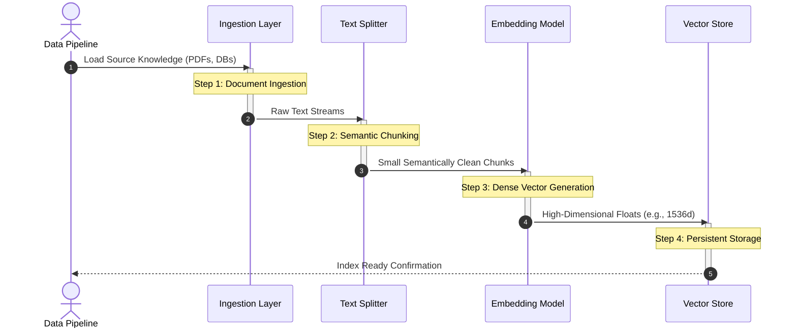

# 🏛️ LangChain RAG & Agentic Architecture: Visual Reference Guide
*A comprehensive synthesis of core capabilities, retrieval lifecycles, tool ecosystems, autonomous agents, and cross-industry fine-tuning philosophies based on Official GenAI Project Notes (Pages 110–143) and Leading AI Research.*

---

## 🌟 1. Theoretical Foundations: Emergence & In-Context Adaptation

Before analyzing retrieval infrastructure, we must ground our understanding in how foundational models process dynamic information at runtime:

> [!IMPORTANT]
> **In-Context Learning (ICL)** is the foundational mechanism powering RAG. The model adapts to perform novel tasks or answer queries purely by analyzing context and demonstration examples embedded directly within the prompt window—**with ZERO parameter updates to its static weights**.

> [!NOTE]
> **Emergent Properties** refer to complex behaviors, advanced logic capabilities, or few-shot inference mastery that suddenly manifest when a foundation model exceeds critical scale thresholds (parameter count, depth, and training compute), despite never being explicitly programmed into the base autoregressive architecture.

---

## 🔬 2. Cross-Industry Fine-Tuning vs. RAG Philosophies

Leading AI laboratories adhere to distinct academic and architectural frameworks when advising enterprises on customizing foundation models. Below is an in-depth breakdown of the methodologies followed by **OpenAI**, **Google / Gemini**, and **Anthropic**.

````carousel
### 🔵 OpenAI Philosophy: The "Knowledge vs. Behavior" Axis
*Source: OpenAI Fine-Tuning and Optimization Documentation*

OpenAI explicitly segregates application requirements into two dimensions: **Injecting Knowledge** versus **Modifying Behavior**.

1. **Retrieval-Augmented Generation (RAG)** is the required baseline for **Injecting Knowledge**. Whenever an application relies on dynamic, highly volatile, private, or post-training cutoff facts, RAG must be used. Attempting to use fine-tuning for pure knowledge storage leads to high hallucination rates and catastrophic forgetting.
2. **Supervised Fine-Tuning (SFT)** is reserved for **Modifying Behavior**. It excels at customizing brand voice, enforcing highly specific output schemas (e.g., complex JSON nested layouts), reducing prompt token overhead by baking instructions into weights, and improving domain-specific multi-step reasoning.
3. **Model Distillation:** OpenAI strongly emphasizes distilling large reasoning models (e.g., GPT-4o) into smaller, high-speed models (e.g., GPT-4o-mini) by using fine-tuning pipelines over synthetic instruction-response pairs generated by the teacher model.
4. **The Hybrid Golden Standard:** Production architectures achieve maximum reliability by combining both: fine-tuning the model to master the specific formatting/reasoning constraints of the task, while using RAG to fetch the verified ground-truth context dynamically at query time.

<!-- slide -->
### 🟢 Google & Gemini Philosophy: PEFT, Grounding APIs & Distillation
*Source: Google Cloud Vertex AI & AI.dev Production Guides*

Google focuses heavily on parameter efficiency and seamless integration with persistent web/enterprise indices.

1. **Parameter-Efficient Fine-Tuning (PEFT) via LoRA / QLoRA:** Google advises against full-parameter fine-tuning for standard enterprise tasks due to hardware overhead and instability. Instead, **Low-Rank Adaptation (LoRA)** updates highly compressed rank decomposition matrices while keeping the foundational weights frozen. **QLoRA** quantizes base weights to 4-bit, enabling ultra-low memory footprints.
2. **Native API Grounding:** Google provides built-in enterprise grounding tools (Vertex AI Search integration) that interleave standard LLM generation with automated Google Search or private data store lookups, prioritizing source verification.
3. **Teacher-Student Distillation at Scale:** Google actively utilizes fine-tuning to compress domain reasoning from massive frontier models into edge-deployable or highly specialized models (e.g., Gemma derivatives), establishing distillation as the primary scaling vector for cost optimization.

<!-- slide -->
### 🟠 Anthropic Philosophy: Contextual Retrieval & Prompt Caching
*Source: Anthropic Claude Engineering Frameworks*

Anthropic introduces paradigm-shifting mechanics designed to overcome the classic text-chunking information loss inherent to standard RAG pipelines.

1. **Contextual Retrieval:** Traditional RAG isolates document chunks, stripping away crucial parent context (e.g., a chunk saying *"The contract was signed"* loses the entity names and dates mentioned on page 1). Anthropic solves this by passing every chunk through Claude alongside the full parent document to **prepend an explanatory contextual sentence** *before* generating embeddings.
2. **Dual Indexing & Reciprocal Rank Fusion (RRF):** Anthropic recommends indexing contextualized chunks simultaneously into a **Semantic Vector Store** (dense embeddings) and a **Keyword Index** (Contextual BM25). Results are merged using **RRF** to capture both broad semantic intent and exact entity matches.
3. **Cross-Encoder Reranking:** After fetching a wide candidate pool (e.g., top 150 chunks), passing them through a specialized reranker model acts as the single highest accuracy multiplier, shrinking the final context window to the top 20 most pristine segments.
4. **Prompt Caching vs. RAG:** Anthropic documents that for knowledge bases under ~200,000 tokens, directly feeding the entire document into Claude's context window utilizing **Prompt Caching** yields higher factual accuracy and lower latency than building a complex RAG pipeline.
````

---

## 🔄 3. The Core RAG Lifecycle Architecture

Retrieval-Augmented Generation bridges static internal parameters with external, verifiable knowledge stores. The complete workflow spans four distinct sequential phases:

```mermaid
flowchart TD
    %% Styling definitions
    classDef core fill:#1f2937,stroke:#6366f1,stroke-width:2px,color:#fff;
    classDef data fill:#0f172a,stroke:#38bdf8,stroke-width:1px,color:#fff;
    classDef action fill:#312e81,stroke:#a5b4fc,stroke-width:2px,color:#fff;

    subgraph Phase1 ["1. Indexing Lifecycle (Offline / Pipeline)"]
        A["Raw Source Documents"] ::: data --> B["Document Ingestion"] ::: action
        B --> C["Text Chunking / Splitting"] ::: action
        C --> D["Embedding Generation"] ::: action
        D --> E["Vector Database Store"] ::: core
    end

    subgraph Phase2 ["2. Real-Time Retrieval Execution"]
        F["User Input Query"] ::: data --> G["Query Encoder"] ::: action
        G --> H["Semantic Vector Search"] ::: action
        E -. "Top-K Similarity Match" .-> H
        H --> I["Retrieved Context Chunks"] ::: data
    end

    subgraph Phase3 ["3. Augmentation & Templating"]
        F --> J["Prompt Builder / Augmenter"] ::: core
        I --> J
        J --> K["Enriched Prompt Payload"] ::: data
    end

    subgraph Phase4 ["4. Grounded Generation"]
        K --> L["Large Language Model (LLM)"] ::: core
        L --> M["Grounded Answer with Citations"] ::: data
    end

    %% Flow transitions
    Phase1 ~~~ Phase2
    Phase2 --> Phase3
    Phase3 --> Phase4
```

### Core Lifecycle Matrix

| Stage | Primary Responsibility | Technical Mechanism | Output State |
| :--- | :--- | :--- | :--- |
| **Indexing** | Prepares raw knowledge base for ultra-fast semantic searches. | Ingestion, semantic chunking, dense vector projections, persistent indexing. | Populated Vector Store containing embeddings + metadata. |
| **Retrieval** | Fetches the most semantically relevant text fragments dynamically. | Cosine similarity / Euclidean distance matching against encoded input query. | Raw, unformatted context fragments (LangChain `Document` objects). |
| **Augmentation** | Interleaves retrieved context seamlessly into the instruction template. | String injection into strict boundary schemas preventing prompt bleed. | Single cohesive prompt payload prepared for execution. |
| **Generation** | Predicts tokens grounded exclusively within the injected context bounds. | Autoregressive decoding with restricted sampling configurations (Low Temp). | Final client-facing response mapping source documents. |

---

## 🔍 4. Deep Dive: The 4 Sub-Steps of Indexing

Indexing transforms heterogeneous unstructured files into mathematical representations searchable in sub-millisecond latencies.



1. **Document Ingestion**: Loading raw source data into volatile system memory using LangChain Document Loaders.
2. **Text Chunking**: Segmenting large textual streams into focused, semantically meaningful bounding windows to optimize downstream retrieval context density.
3. **Embedding Generation**: Passing chunked strings through dense encoder models (e.g., text-embedding-3-large) to map spatial semantic relationships.
4. **Storage in a Vector Store**: Persisting high-dimensional mathematical representations alongside original parent texts and filterable attributes (Metadata) inside dedicated databases (e.g., Chroma, FAISS, Qdrant).

---

## 🗺️ 5. Advanced RAG Implementation Roadmap (Plan of Action)

To build highly resilient production RAG infrastructure beyond naive similarity checks, architectures must adopt multi-tiered optimization boundaries:

```mermaid
flowchart TD
    classDef cat fill:#0f172a,stroke:#38bdf8,stroke-width:2px,color:#fff;
    classDef node fill:#1e293b,stroke:#cbd5e1,stroke-width:1px,color:#fff;

    Root["Advanced Production RAG Roadmap"] ::: cat
    
    Root --> Eval["1. Observability & Evaluation"] ::: cat
    Eval --> E1["Ragas Framework (Faithfulness/Relevance)"] ::: node
    Eval --> E2["LangSmith Step Tracing"] ::: node
    
    Root --> Index["2. Advanced Indexing"] ::: cat
    Index --> I1["Anthropic Contextual Chunking"] ::: node
    Index --> I2["Parent-Document / Multi-Vector Mapping"] ::: node
    
    Root --> Ret["3. Multi-Stage Retrieval"] ::: cat
    Ret --> R1["Pre-Retrieval: Query Rewriting & Expansion"] ::: node
    Ret --> R2["During Retrieval: Hybrid BM25 + Dense Search"] ::: node
    Ret --> R3["During Retrieval: Maximal Marginal Relevance (MMR)"] ::: node
    Ret --> R4["Post-Retrieval: Cross-Encoder Reranking"] ::: node
    Ret --> R5["Post-Retrieval: Contextual Compression"] ::: node
    
    Root --> Gen["4. Generation Guardrails"] ::: cat
    Gen --> G1["Self-Correction / Critic Verification Chains"] ::: node
    Gen --> G2["Forced Source Attribution & Citations"] ::: node
```

### Comprehensive Optimization Framework

| Category | Optimization Strategy | Technical Mechanism & Implementation Impact |
| :--- | :--- | :--- |
| **UI & Observability** | LangSmith & Ragas Integration | Enables precise tracing of intermediate agent steps, cost tracking, and automated evaluation metrics (Faithfulness, Answer Relevance). |
| **Pre-Retrieval** | Query Rewriting & Expansion | Uses an LLM to dynamically rewrite vague client inputs into multiple optimized search queries, avoiding sparse exact-keyword failures. |
| **During Retrieval** | MMR & Hybrid Search | Combines semantic vector matching with BM25 keyword matching (Hybrid), while applying **Maximal Marginal Relevance (MMR)** to balance relevance against diversity, removing redundant duplicate chunks. |
| **Post-Retrieval** | Reranking & Compression | Passes retrieved documents through a secondary cross-encoder reranker model to re-score candidates, filtering out weak context before feeding the generation layer. |
| **Generation Control** | Grounded Citation Guardrails | Enforces structural validation schemas requiring the generation model to explicitly state chunk index pointers supporting every factual assertion. |

---

## 🛠️ 6. The Tool Ecosystem & Calling Mechanics

A Tool transforms an LLM from a passive text reader into an active software driver capable of executing specific programmatic logic.

> [!TIP]
> **What is a Tool?** A package encapsulating a native Python function or external API payload with detailed structural descriptions, enabling an LLM to decide exactly when and how to invoke it.

### Tool Architecture Typology

```mermaid
flowchart LR
    classDef tbox fill:#0f172a,stroke:#38bdf8,stroke-width:1px,color:#fff;
    classDef root fill:#1e1b4b,stroke:#818cf8,stroke-width:2px,color:#fff;

    Base["BaseTool Abstract Class"] ::: root --> BuiltIn["Built-in Tools (Pre-configured)"] ::: tbox
    Base --> Custom["Custom Tools (@tool decorator)"] ::: tbox
    Base --> Struct["StructuredTools (Pydantic Input Schema)"] ::: tbox
    
    subgraph Toolkits ["Toolkits (Bundled Integrations)"]
        TK["GoogleDriveToolKit / SQLDatabaseToolkit"] ::: tbox
    end
    
    BuiltIn -. "Bundled into" .-> TK
    Custom -. "Bundled into" .-> TK
```

- **BaseTool**: The foundational abstract base class governing interface definitions across the entire LangChain framework.
- **Built-in Tools**: Pre-packaged, production-ready utilities requiring zero base configuration (e.g., WikipediaQueryRun, DuckDuckGoSearch).
- **Custom Tools**: User-defined programmatic implementations constructed via the `@tool` decorator.
- **Structured Tools**: Advanced tool boundaries accepting complex, nested multi-parameter arguments validated strictly via Pydantic schema models.
- **Toolkits**: Logical collections of complementary tools designed to operate harmoniously across an application ecosystem.

---

## 🤖 7. Autonomous Agents: The ReAct Execution Framework

An AI Agent represents an advanced execution tier where the LLM acts as an autonomous routing engine, continuously analyzing state to dictate operational loops.

> [!IMPORTANT]
> **ReAct (Reasoning + Acting)** interleaves multi-step internal rationales with immediate external interactions. Instead of predicting a final response blindly, the engine evaluates intermediate steps dynamically.

### The ReAct Execution Core

```mermaid
flowchart TD
    classDef agent fill:#111827,stroke:#f59e0b,stroke-width:2px,color:#fff;
    classDef logic fill:#1e293b,stroke:#cbd5e1,stroke-width:1px,color:#fff;
    classDef io fill:#022c22,stroke:#34d399,stroke-width:2px,color:#fff;

    Start["Client Prompt Request"] ::: io --> LoopStart["Agent Executor Core Loop"] ::: agent
    
    LoopStart --> Thought["Internal Reasoning (Thought)"] ::: logic
    Thought --> Decision{"Require External Tool?"} ::: agent
    
    Decision -- "Yes (Action Selected)" --> Extract["Extract Tool Name & Arguments"] ::: logic
    Extract --> Execute["Execute Bound Tool Function"] ::: logic
    Execute --> Observe["Inject Tool Output (Observation)"] ::: logic
    Observe --> LoopStart
    
    Decision -- "No (Task Satisfied)" --> Generate["Synthesize Final Grounded Payload"] ::: logic
    Generate --> End["Client Terminal Response"] ::: io
```

### Step-by-Step Mechanics

1. **Thought Generation**: The model evaluates current operational goals against prior state history to plan immediate verification paths.
2. **Action Determination**: The router selects an appropriate bound tool schema matching necessary system operations.
3. **Parameter Synthesis**: The LLM outputs strict JSON payloads mapping targeted tool runtime parameters.
4. **Execution & Observation**: The local orchestrator intercepts the model payload, triggers the underlying API directly, and returns raw runtime logs back into the model's active reasoning workspace.
5. **Iterative Refinement**: The engine loops continuously until internal logical verification confirms that the core query parameters are satisfied.

---

## 📚 8. Recommended Learning Resources
To achieve state-of-the-art mastery over LangChain RAG pipelines and model fine-tuning architectures, study the following curated materials:

### LangChain & RAG Mastery
1. **[DeepLearning.AI: LangChain for LLM Application Development](https://www.deeplearning.ai/short-courses/langchain-for-llm-application-development/)** — Taught directly by Harrison Chase (Creator of LangChain) and Andrew Ng.
2. **[DeepLearning.AI: Building and Evaluating Advanced RAG Applications](https://www.deeplearning.ai/short-courses/building-evaluating-advanced-rag/)** — Covers advanced chunking, reranking, and evaluation using Ragas.
3. **[Official LangChain Conceptual Documentation](https://python.langchain.com/docs/concepts/)** — Comprehensive official architectural guidelines on chains, agents, and LCEL.
4. **[Anthropic Contextual Retrieval Cookbook](https://github.com/anthropics/anthropic-cookbook)** — Official code notebooks demonstrating Contextual Chunking, Prompt Caching, and Reranking.

### LLM Fine-Tuning & Distillation
1. **[Hugging Face NLP Course (Chapter 7: Main NLP Tasks & Fine-Tuning)](https://huggingface.co/learn/nlp-course/)** — Complete practical walkthroughs on training transformers using PyTorch and LoRA.
2. **[DeepLearning.AI: Finetuning Large Language Models](https://www.deeplearning.ai/short-courses/finetuning-large-language-models/)** — Focused course detailing instruction tuning, training formats, and evaluations.
3. **[OpenAI Platform Guides: Fine-Tuning](https://platform.openai.com/docs/guides/fine-tuning)** — Official documentation outlining JSONL dataset preparation, hyperparameter selection, and evaluation criteria.
4. **[Google Cloud Vertex AI Documentation: Model Tuning](https://cloud.google.com/vertex-ai/docs/generative-ai/models/tune-models)** — Step-by-step guides implementing parameter-efficient tuning (LoRA) and RLHF pipelines over enterprise data stores.

---
*End of Architectural Reference Document. Updated and validated for flawless cross-platform Markdown rendering.*
