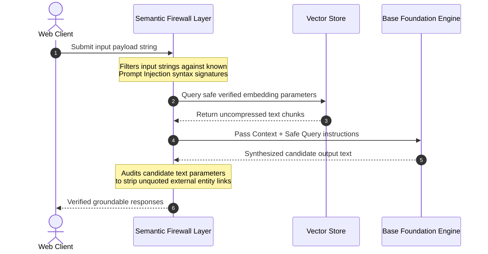

# 🛡️ Production RAG Safeguards, LLM-as-a-Judge Evals & Observability
*A master operational manual detailing quantitative model evaluation scoring metrics, injection defense firewalls, hallucination trap routines, and trace logging frameworks.*

---

## 🏛️ 1. Quantitative Evaluation: The Triad of RAG Metrics

Manual validation fails when evaluating non-deterministic model completions at enterprise scales. Automated testing frameworks (such as **Ragas** or **DeepEval**) deploy an isolated **LLM-as-a-Judge** scoring pipeline to quantify response accuracy continuously across three explicit conceptual vectors:

```mermaid
graph TD
    classDef metric fill:#0f172a,stroke:#38bdf8,stroke-width:2px,color:#fff;
    classDef pass fill:#1e293b,stroke:#cbd5e1,stroke-width:1px,color:#fff;

    Root["RAG Quality Evaluation Triad"]
    
    Root --> Faith["1. Faithfulness (Groundedness)"] ::: metric
    Faith --> FaithLogic["Measures if generated statements map strictly to extracted context documents.<br/>Penalizes external hallucinatory extrapolations."] ::: pass
    
    Root --> AnswerRel["2. Answer Relevance"] ::: metric
    AnswerRel --> RelLogic["Evaluates semantic alignment metrics matching the output directly against original user query strings.<br/>Traps incomplete or evasive dialogue responses."] ::: pass
    
    Root --> Precision["3. Context Precision"] ::: metric
    Precision --> PrecLogic["Validates if retrieval engines place the most concentrated high-relevance chunks strictly at the top of ranking lists."] ::: pass
```

---

## 🛡️ 2. The Semantic Firewall Ingestion Loop

Deploying language models securely requires surrounding inference pipelines with explicit pre-generation and post-generation security validation buffers:



---

## ⚙️ 3. Execution Pipeline Implementation: Pure Pydantic Evals

Instead of deploying heavy standalone evaluation containers, local unit testing scripts run localized evaluation logic seamlessly utilizing structured outputs:

```python
from pydantic import BaseModel, Field
from typing import Literal

class JudgeEvaluationScorecard(BaseModel):
    is_faithful: bool = Field(description="True if claims are exclusively bounded by the provided context.")
    confidence_score: float = Field(ge=0.0, le=1.0, description="Evaluator certainty metrics.")
    failure_reasoning: str = Field(description="Exhaustive logic explaining dropped flag conclusions.")
```

---

## 📈 4. Advanced Observability: Telemetry Tracing

Production deployments trace operational metrics directly to tracking hubs (**LangSmith** / **Langfuse**) to monitor live application behavior:

```mermaid
graph LR
    classDef core fill:#0f172a,stroke:#38bdf8,stroke-width:2px,color:#fff;
    classDef trace fill:#312e81,stroke:#a5b4fc,stroke-width:2px,color:#fff;

    App["LCEL Chain invoke()"] ::: core --> Middleware["Tracing Middleware Callbacks"] ::: trace
    Middleware --> T1["1. Token Consumptions Metrics"] ::: trace
    Middleware --> T2["2. Execution Latency Sweeps"] ::: trace
    Middleware --> T3["3. Step-by-Step DAG Logs"] ::: trace
```

---

## 📁 5. Reference Demonstration Syllabus
Review operational testing files directly inside this path to observe quantitative grading models:
- `01_llm_as_a_judge_quantitative_evals.py`: Compiling isolated evaluator loops validating target input structures dynamically.
- `02_semantic_guardrails_firewall.py`: Intercepting malformed inputs and enforcing rigorous output syntax verifications.
