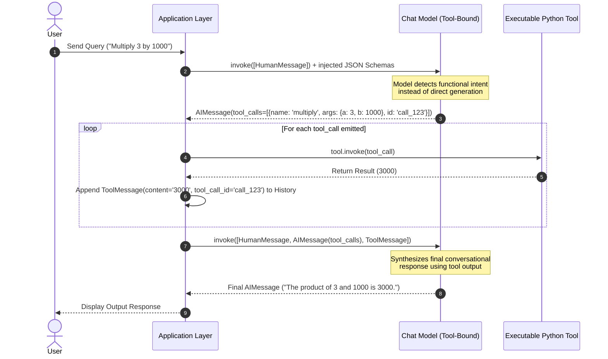

# ⚙️ Module 02: Deep-Dive into Tool Calling Lifecycle, Argument Injection, & ReAct Agents
*A comprehensive guide explaining the end-to-end mechanisms of LangChain Tool Calling, manual message state handling, dynamic parameter injection via `InjectedToolArg`, and autonomous agent loop orchestration.*

---

## 🔄 1. The End-to-End Tool Calling Lifecycle

Tool calling enables modern LLMs to reliably emit structured functional intent (arguments and function targets) instead of returning raw plaintext responses. The core concept is **separation of concerns**: the model *plans* the call, but the local application execution layer *invokes* the actual logic and feeds the results back to the model.



---

## 🛠️ 2. Core Execution Objects & Message Types

Understanding tool calling requires familiarity with three specific message payloads managed inside the LangChain state loop:

### 📥 1. `HumanMessage`
- **Purpose**: Represents the initial or continuous user instruction/prompt driving the pipeline flow.

### 🤖 2. `AIMessage` (with `tool_calls`)
- **Structure**: When a bound model opts to trigger a tool, its returned `AIMessage` sets `.content = ""` and populates the `.tool_calls` array.
- **Payload Attributes**:
  - `name`: Target function string identifier matching the registered tool.
  - `args`: Validated Python dictionary payload synthesized to perfectly fit the tool's expected Pydantic schema.
  - `id`: Unique execution identifier assigned by the LLM backend (e.g., `call_abc123`).

### 🔧 3. `ToolMessage`
- **Purpose**: Communicates raw computational outputs back to the engine. It **must** explicitly reference the source `tool_call_id` to allow the LLM attention heads to map which observation belongs to which requested step.

---

## 💉 3. Advanced Pattern: Dynamic Argument Injection (`InjectedToolArg`)

In advanced execution flows, certain internal parameter states (such as active database session handles, user ID tokens, or intermediate pipeline payloads) should **never** be generated by the LLM. 

LangChain provides the `InjectedToolArg` annotation marker to resolve this constraint elegantly:

```python
from langchain_core.tools import tool, InjectedToolArg
from typing import Annotated

@tool
def process_secure_transaction(
    amount: float, 
    auth_token: Annotated[str, InjectedToolArg]
) -> str:
    """Processes a financial transaction. The LLM only sees 'amount' in the schema."""
    # Logic utilizing both LLM-planned 'amount' and locally injected 'auth_token'
    return f"Success: {amount} processed using token {auth_token[:4]}..."
```

### 🔍 How Injection Functions Internally:
1. **Schema Truncation**: When `llm.bind_tools()` evaluates the signature, it drops any parameter annotated with `InjectedToolArg` from the emitted OpenAPI JSON Schema.
2. **Context Safety**: The model operates under the illusion that the tool requires only the standard parameters (e.g., `amount`).
3. **Runtime Assembly**: During the execution phase, application logic injects the protected variable payload manually into the `tool_call['args']` dictionary prior to calling `.invoke()`.

---

## 🤖 4. Autonomous Agent Loop Orchestration (ReAct)

Manually constructing loops to track message histories, extract tool calls, append `ToolMessage` payloads, and trigger subsequent generation passes becomes cumbersome for multi-step tasks. 

LangChain abstracts this entire state loop into optimized **Agent Executors**:

```mermaid
flowchart TD
    classDef init fill:#0f172a,stroke:#38bdf8,stroke-width:2px,color:#fff;
    classDef loop fill:#1e293b,stroke:#cbd5e1,stroke-width:1px,color:#fff;
    classDef exit fill:#022c22,stroke:#34d399,stroke-width:2px,color:#fff;

    Start["AgentExecutor.invoke({'input': query})"] ::: init
    
    subgraph ReAct Architecture State Loop
        Thought["Agent analyzes context (Thought)"] ::: loop
        ActionChoice{"Action Required?"} ::: loop
        
        Thought --> ActionChoice
        ActionChoice -- Yes --> Execute["Execute targeted tool locally"] ::: loop
        Execute --> Observe["Feed Observation back to context"] ::: loop
        Observe --> Thought
    end
    
    ActionChoice -- No --> Finish["Emit Final Synthesis Response"] ::: exit
    Start --> Thought
```

### 🏆 Top Agent Types for Structured Tools:
- **`STRUCTURED_CHAT_ZERO_SHOT_REACT_DESCRIPTION`**: Specifically engineered to support multi-input tools using nested JSON validation structures.
- **`OPENAI_TOOLS` / `OPENAI_FUNCTIONS`**: Utilizes native model API layer capabilities to achieve exceptional parameter precision and parallel execution speeds.

---
*End of Module 02 Documentation Reference Guide.*
