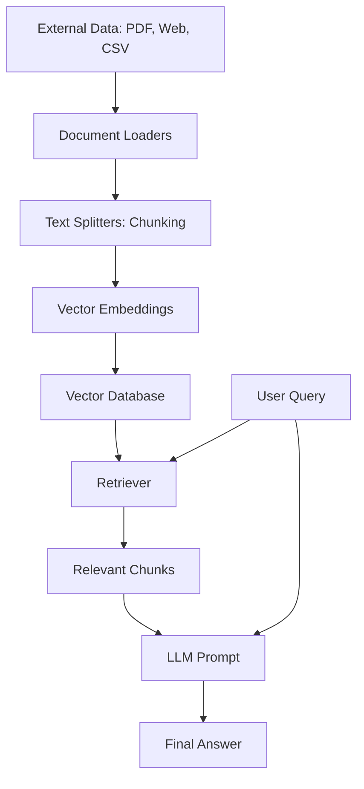

# 🦜 LangChain RAG & Document Loaders

Welcome to the comprehensive guide on **Retrieval-Augmented Generation (RAG)** and **Document Loaders**. This project explains how to bring external data into LLMs using LangChain.

## 📊 RAG Workflow (Flowchart)

## 📑 Document Loader Comparison

| Loader | Use Case | Strength | Limitation |
| :--- | :--- | :--- | :--- |
| **TextLoader** | `.txt`, `.md` | Fast, reliable | Plain text only |
| **PyPDFLoader** | Standard PDFs | Page-level metadata | Fails on scanned/image PDFs |
| **WebBaseLoader** | Web Scraping | Easy to use | No JavaScript support |
| **CSVLoader** | Tabular Data | Row-by-row tracking | High memory for large files (if not lazy) |
| **DirectoryLoader** | Bulk Folders | Multi-file processing | Requires mapping file types to loaders |
| **Custom Loader** | Proprietary formats | Fully customizable | Needs manual implementation |

## 📁 Directory Guide

1. `01_rag_and_chunking.py`: Basics of splitting text into chunks.
2. `02_pdf_loader_pro.py`: Advanced PDF loading and alternatives.
3. `03_webbase_loader_pro.py`: Scraping web content for search.
4. `04_csv_loader_pro.py`: Handling structured data with `source_column`.
5. `05_directory_lazy_loading.py`: Efficient loading of multiple files.
6. `06_custom_loader_demo.py`: Building your own loader from scratch.
7. `07_custom_loader.py`: Original custom loader implementation.

## 🚀 Loading vs. Lazy Loading

> [!TIP]
> **Lazy Loading** is superior for production! Instead of loading 10GB of data into RAM, it reads one piece at a time, processes it (e.g., sends to VectorDB), and moves to the next.

## 🔌 Project Idea: Chrome Search Plugin
Check out the `08_chrome_extension_backend.py` (Work in progress) for a conceptual backend that uses `WebBaseLoader` to allow users to "chat with the current page".
