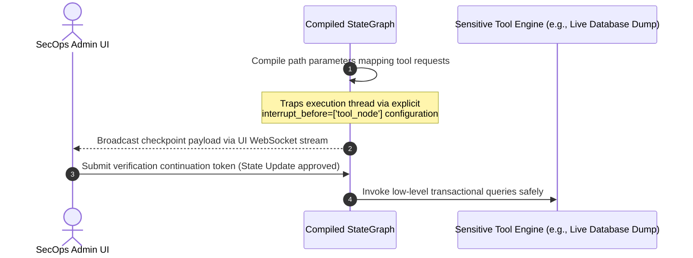

# 🕸️ LangGraph Multi-Agent Systems & State Machine Orchestration
*A production reference manual detailing cyclical Agentic graph compilation, persistent stateful memory trackers (`checkpointer`), conditional routing logic, and dynamic multi-agent supervisor systems.*

---

## 🏛️ 1. The Core Paradigm Shift: From Chains to State Machines

Standard application logic relies on Directed Acyclic Graphs (DAGs) executed sequentially via LangChain Expression Language (LCEL). However, autonomous agents require non-linear execution patterns capable of recursive reflection, iterative trial-and-error tools invocation, and external dynamic routing loops.

**LangGraph** resolves this operational limit by modeling agent workflows as highly persistent State Machines built on three core topological primitives:

```mermaid
graph TD
    classDef state fill:#0f172a,stroke:#38bdf8,stroke-width:2px,color:#fff;
    classDef node fill:#1e293b,stroke:#cbd5e1,stroke-width:1px,color:#fff;
    classDef edge fill:#022c22,stroke:#34d399,stroke-width:2px,color:#fff;

    Root["LangGraph Core Architectural Components"]
    
    Root --> State["1. State (TypedDict / Pydantic BaseModel)"] ::: state
    State --> StateDesc["Central memory payload shared globally across all graph steps.<br/>Attributes append/overwrite using dedicated Reducer callbacks."] ::: state
    
    Root --> Nodes["2. Nodes (Execution Functions)"] ::: node
    Nodes --> NodeDesc["Pure deterministic Python logic blocks or LLM inference runnables.<br/>Accepts active State dictionaries and returns updated parameter increments."] ::: node
    
    Root --> Edges["3. Edges (Static & Conditional Transitions)"] ::: edge
    Edges --> EdgeDesc["Determines routing paths downstream.<br/>Conditional Edges evaluate current state dynamically to select destination nodes."] ::: edge
```

---

## 🔄 2. The Cyclical ReAct Agent Graph Topology

A standard implementation maps dynamic loops tracing `Thought -> Action -> Observation` natively inside the Graph state buffer:

```mermaid
flowchart TD
    classDef startEnd fill:#022c22,stroke:#34d399,stroke-width:2px,color:#fff;
    classDef process fill:#0f172a,stroke:#38bdf8,stroke-width:2px,color:#fff;
    classDef eval fill:#312e81,stroke:#a5b4fc,stroke-width:2px,color:#fff;

    Start((__start__)) ::: startEnd --> AgentNode["🤖 Agent Node<br/>(LLM evaluates current State messages)"] ::: process
    
    AgentNode --> EvalTool{"Tool Calls Requested?"} ::: eval
    
    EvalTool -- Yes --> ToolNode["🛠️ Tool Execution Node<br/>(Invokes mapped schema logic)"] ::: process
    ToolNode --> AgentNode
    
    EvalTool -- No --> End((__end__)) ::: startEnd
```

### 🧠 Reducer Pipeline Mechanics:
In standard dictionaries, setting `state["messages"] = [new_msg]` destroys older message buffers. LangGraph implements pure state updates via specific reducer logic:

```python
from typing import TypedDict, Annotated
import operator
from langchain_core.messages import BaseMessage

class AgenticGraphState(TypedDict):
    # The Annotated operator.add parameter forces list array appends automatically
    messages: Annotated[list[BaseMessage], operator.add]
```

---

## 👑 3. Advanced Multi-Agent Topology: The Supervisor Router

Scaling systems to handle disparate feature workflows requires decomposing domain expertise across highly decoupled sub-agents coordinated by a centralized routing engine:

```mermaid
graph TD
    classDef super fill:#0f172a,stroke:#38bdf8,stroke-width:2px,color:#fff;
    classDef worker fill:#1e293b,stroke:#cbd5e1,stroke-width:1px,color:#fff;

    Input["Incoming User Request"] --> Supervisor["👑 Centralized Supervisor Agent Node"] ::: super
    
    Supervisor --> Route{"Evaluate Domain Affinity"}
    
    Route -- Programming Tasks --> Coder["💻 Specialist Coder Sub-Agent Node"] ::: worker
    Route -- Factual Background Lookup --> Scholar["📚 Specialist Researcher Sub-Agent Node"] ::: worker
    
    Coder --> Supervisor
    Scholar --> Supervisor
    
    Supervisor -- Final Validation Pass Approved --> TerminalOutput["Final Executed Artifact"]
```

---

## ⏸️ 4. Enterprise Human-in-the-Loop (HITL) Checkpoints

Automated tool executors introduce security vulnerabilities if permitted to manipulate underlying production stores freely. LangGraph implements synchronous checkpoints using native interrupt signals:



---

## 📁 5. Executable Workspace Syllabus Reference
To inspect dynamic cyclical tracking, run scripts inside this folder directly:
- `01_langgraph_foundations_state_graphs.py`: Bootstrapping base reducer states, node mapping blocks, and persistent thread memory checkpoint instances.
- `02_supervisor_multi_agent_router.py`: Executing parallel multi-agent dialogue loops inside collaborative thread maps.
- `03_human_in_the_loop_approval.py`: Orchestrating execution pauses and dynamic state mutation injects.
