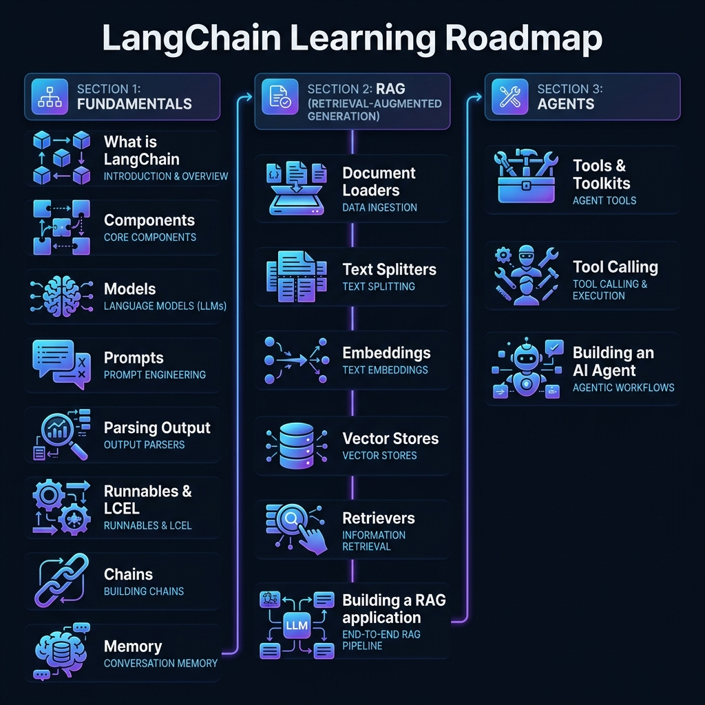

# LangChain Learning Journey (CampusX Course)

Following the CampusX [Generative AI Playlist](https://www.youtube.com/playlist?list=PLKnIA16_RmvaTbihpo4MtzVm4XOQa0ER0).

## Roadmap & Progress

### Phase 1: Fundamentals
- [x] **Environment Setup** (Venv, SDKs, API Keys)
- [ ] **What is LangChain**
- [ ] **Components & Models**
- [ ] **Prompts & Output Parsers**
- [ ] **Runnables & LCEL**
- [ ] **Chains & Memory**

### Phase 2: RAG (Retrieval-Augmented Generation)
- [ ] **Document Loaders & Splitters**
- [ ] **Embeddings & Vector Stores**
- [ ] **Retrievers**
- [ ] **Building a RAG Application**

### Phase 3: Agents
- [ ] **Tools & Toolkits**
- [ ] **Tool Calling**
- [ ] **Building an AI Agent**

---
**Current Task**: Set `GOOGLE_API_KEY` in `.env` and run `langchain_hello.py`.
# GenAI
