#  Production Generative AI & LangChain Architecture Master Curriculum
*An enterprise reference codebase bridging theoretical cognitive research, production-level code patterns, declarative LCEL orchestrations, vector database geometries, and autonomous ReAct agent loops.*

---

## 🗺️ Visual Architecture Roadmap

```mermaid
graph TD
    classDef base fill:#0f172a,stroke:#38bdf8,stroke-width:2px,color:#fff;
    classDef rag fill:#1e293b,stroke:#cbd5e1,stroke-width:1px,color:#fff;
    classDef agent fill:#022c22,stroke:#34d399,stroke-width:2px,color:#fff;

    Root["Master Generative AI Workspace Ecosystem"]
    
    Root --> Core["Module 01: Core Framework Primitives"]
    Core --> Prompts["Prompting & History Windows"]
    Core --> Models["Chat Models & Vector Transformers"]
    Core --> Parsers["Output Parsing & Syntax Traps"]
    Core --> LCEL["Declarative Pipelines (LCEL)"]
    
    Root --> RAG["Module 02: Retrieval-Augmented Generation (RAG)"]
    RAG --> Loaders["Document Loaders & Lazy Streaming"]
    RAG --> Chunking["Text Splitters & Semantic Clustering"]
    RAG --> Stores["Vector Stores & Chroma Hierarchy"]
    RAG --> Retrieve["Advanced Retrieval & Hybrid RRF Search"]
    
    Root --> Agentic["Module 03: Agentic Orchestration"]
    Agentic --> Tools["Tool Binding & InjectedToolArg"]
    Agentic --> Hub["LangChain Hub Centralized Prompts"]
    Agentic --> Loops["AgentExecutor ReAct State Lifecycles"]

    class Root,Core,Prompts,Models,Parsers,LCEL base;
    class RAG,Loaders,Chunking,Stores,Retrieve rag;
    class Agentic,Tools,Hub,Loops agent;
```



---

## 📁 Comprehensive Directory & File Structure Reference

```text
Gen-AI/
├── Prompt-Engineering/                                # Core instruction design and multi-path cognitive schemes
│   ├── level_1_foundations.py                         # Zero-shot, Few-shot, and role prompting structural blocks
│   ├── level_2_advanced_reasoning.py                  # Step-by-step Chain-of-Thought (CoT) rationalization paths
│   ├── level_3_platform_specific.py                   # Translating boundaries across OpenAI, Claude XML, and Gemini
│   ├── level_4_production_agents.py                   # Dynamic execution context state injection simulations
│   ├── example_new_01_self_consistency.py             # Parallel multi-thread sampling majority voting loops
│   ├── example_new_02_dynamic_few_shot.py             # Prepending dynamic historical context references
│   └── prompt_engineering_syllabus.md                 # Master comparative cognitive architecture syllabus
│
├── Langchain-Prompts/                                 # String generation templates and persistent chat array logs
│   ├── prompt_template.py                             # Standard string formatting placeholder configurations
│   ├── chat_prompt_template.py                        # Mapping variable dictionaries to strict System/Human arrays
│   ├── messages.py / message_placeholder.py           # Explicit object message boundaries serialization checks
│   ├── example_new_01_few_shot_prompt.py              # Injecting rigid operational few-shot example maps
│   ├── example_new_02_few_shot_chat_prompt.py         # Multi-turn few-shot mapping over structured roles
│   ├── example_new_03_partial_prompts.py              # Pre-populating constant parameters selectively
│   ├── example_new_04_pipeline_prompts.py             # Composing layered hierarchical multi-prompt pipelines
│   └── langchain_messages_guide.md                    # Core architecture blueprint mapping trim_messages sliding windows
│
├── LangChain-Models/                                  # LLMs, native multi-role Chat engines, and spatial transformers
│   ├── universal_parameter_guide.py                   # Exhaustive matrix mapping model temperature and sampling limits
│   ├── openai_llm_demo.py / opeai-chatmodel-demo.py   # OpenAI cloud interfaces and role array execution tests
│   ├── gemini-chat-model.py / groq-chat-model.py      # Standard multi-provider framework integration endpoints
│   ├── huggingface-chat-model-local.py                # Standalone flat engine offline inference scripts
│   ├── example_new_01_model_streaming.py              # Low-latency asynchronous iterator response pipelines
│   ├── example_new_02_model_caching.py                # Intercepting repeat payloads using RAM/SQLite buffers
│   ├── example_new_03_token_tracking.py               # Auditing live cloud invocation costs utilizing background callbacks
│   ├── example_new_04_multimodal_inputs.py            # Passing rich Base64/URI image files to visual attention systems
│   └── README.md                                      # Core visual reference matrix comparing String vs Message roles
│
├── LangChain-Output Parsers/                          # Coercing string generation down to typed object instances
│   ├── stroutputparser.py / jsonoutputparser.py       # Direct character passes and clean plain dictionary wrappers
│   ├── structuredoutputparser.py                      # Explicit ResponseSchema validation mapping models
│   ├── pydanticoutputparser.py                        # Highly typed runtime Pydantic BaseModel compilation blocks
│   ├── example_01_str_output_parser.py ...            # Six incremental integration scripts executing custom types
│   └── output_parsers_guide.md                        # Master architectural extraction manual and auto-correction trace loops
│
├── LangChain-structured-output/                       # Native platform provider schema translations
│   ├── typeddict_demo.py / pydantic_demo.py           # Core native static blueprint parameter comparisons
│   ├── with_structured_output_json.py                 # Forcing structured parameters via straight JSON Schema runs
│   ├── with_structured_output_pydantic.py             # Integrating highly reliable validation layers
│   ├── with_structured_output_typeddict.py            # High-speed runtime framework translations
│   ├── example_new_01_include_raw.py                  # Preserving source context data alongside extracted object dictionaries
│   ├── example_new_02_strict_mode.py                  # Forcing explicit backend format validation constraints
│   └── structured_output_guide.md                     # Deep technical reference outlining OpenAPI format injection rules
│
├── LangChain-Chains/                                  # Declarative pipeline string construction workflows (LCEL)
│   ├── simple_chain.py / sequential_chain.py          # Classical stateful task loops vs. piping runnables
│   ├── parallel_chain.py / conditional_chain.py       # Concurrent thread aggregations and dynamic boolean switches
│   ├── example_01_simple_chain.py ...                 # Eight complete files documenting custom runtime actions
│   └── README.md                                      # Breathtaking reference guide mapping visual runnable logic topologies
│
├── LangChain-RAG-Document-Loaders/                    # Enterprise document ingestion modules
│   ├── 01_rag_and_chunking.py                         # Basic string file splitting and structural Document envelope packaging
│   ├── 02_pdf_loader_pro.py                           # Deep page iteration layers tracking internal metadata blocks
│   ├── 03_webbase_loader_pro.py                       # High-speed concurrent public Web page DOM extraction paths
│   ├── 04_csv_loader_pro.py                           # Tabular row separation utilizing user source_column metrics
│   ├── 05_directory_lazy_loading.py                   # High-throughput streaming iterator ingestion files (lazy_load)
│   ├── 06_custom_loader_demo.py                       # Building customized generator loops handling proprietary assets
│   └── README.md                                      # Definitively structured extraction matrix and memory usage profiles
│
├── LangChain-RAG-text-splitters/                      # Spatial positioning token slices
│   ├── 01_understanding_chunking.py ...               # Seven highly focused execution files testing boundaries
│   ├── 05_semantic_chunking.py                        # Advanced Cosine Distance variance chunking implementations
│   └── text_splitters_pro_guide.md                    # Core visual blueprint explaining Size vs Overlap sizing rules
│
├── LangChain-RAG-Vector-Stores/                       # High-density database indexing systems
│   ├── 01_embeddings_pro.py                           # Calling spatial geometric transformer array mappings
│   ├── 02_chromadb_pro.py                             # Multi-tenant operational domain bounds (Tenant->DB->Collection)
│   ├── 03_faiss_pro.py / 04_pinecone_pro.py           # Blistering local flat RAM storage arrays vs decoupled secure cloud DBs
│   ├── 05_semantic_search_techniques.py               # Computing absolute distance and directional scalar operations
│   ├── 06_advanced_retrieval_strategies.py            # Enforcing output sequence diversity via Maximum Marginal Relevance (MMR)
│   └── README.md                                      # High-density architectural topologies and distance metric tables
│
├── LangChain-RAG-Retrievers/                          # Specialized contextual filtering algorithms
│   ├── 01_retriever_basics_pro.py                     # Instantiating base vector DB lookups mapping unstructured user queries
│   ├── 02_multi_query_retriever_pro.py                # Enhancing recall bounds using query alternative variant iterations
│   ├── 03_contextual_compression_pro.py               # Stripping irrelevant noise from surrounding chunks prior to LLM injection
│   ├── 04_ensemble_hybrid_search_pro.py               # Fusing sparse BM25 arrays with dense vectors via Reciprocal Rank Fusion
│   ├── 05_parent_document_retriever_pro.py            # Granular sub-chunk positioning preserving global upstream parent documents
│   ├── 06_self_querying_pro.py                        # Parsing conversational search phrasing into structured metadata filter filters
│   └── retrievers_master_guide.md                     # Comprehensive design specification detailing advanced DAG indexing flows
│
├── LangChain-RAG/                                     # High-level RAG integration orchestrations
│   ├── rag_using_langchain.ipynb                      # Complete execution notebook testing ingestion and extraction threads
│   └── README.md                                      # Core structural comparison matrix mapping RAG vs Fine-Tuning workflows
│
├── LangChain-Tools-and-Tools-calling/                 # Localized custom Python tool definitions
│   ├── 01_mastering_langchain_tools_and_components.py # Legacy class tool wraps vs native micro-tools decorators
│   ├── 02_mastering_tool_calling_and_agents.py        # Enterprise dynamic variable masking models (InjectedToolArg)
│   └── 02_mastering_tool_calling_and_agents.md        # Sequence diagrams detailing model tool request extraction loops
│
├── LangChain-end-to-end-agent/                        # ReAct multi-tool routing loops
│   ├── 03_mastering_agents_and_langchain_hub.py       # Executable application integrating direct raw hub templates
│   └── 03_mastering_agents_and_langchain_hub.md       # Full visual sequence mappings comparing AgentExecutor with LangGraph
│
└── project-idea-GenAI/                                # High-level design documentation
    └── chromewebpageplugin.md                         # End-to-end technical specification mapping extension frontends to FastAPI
```

---

## 🎯 Curated Execution Roadmap & Progress Checklist

### 📘 Phase 1: Core Primitives & LCEL Composition
- [x] **Prompt Engineering Foundations**: Zero-shot, Few-shot style transfers, XML tagging structures, and **Self-Consistency** evaluation chains (`Prompt-Engineering/`).
- [x] **Message Management**: Class interfaces (`SystemMessage`, `HumanMessage`), token sliding window truncation buffers (`trim_messages`), and stateful DB history sync (`Langchain-Prompts/`).
- [x] **Language & Embedding Engines**: Direct completion interfaces vs. modern role-aware Chat Engines, dense spatial float coordinates, chunk streaming (`.stream()`), and persistent request storage caches (`LangChain-Models/`).
- [x] **Output Extraction Parsers**: Mapping predictions to dictionary maps, strict JSON schema injections, Pydantic type coercions, and auto-correcting feedback loops (`LangChain-Output Parsers/`, `LangChain-structured-output/`).
- [x] **Declarative Chaining**: Standardizing procedural execution tasks using modern Unix-style piping operators (`|`), structural runnables mapping concurrent aggregations (`RunnableParallel`), and conditional path execution tracks (`LangChain-Chains/`).

---

### 📙 Phase 2: Knowledge Ingestion & RAG Engineering
- [x] **Document Ingestion**: Parsing pure plaintext streams, native structural PDFs, tab-delimited records, asynchronous HTTP web scrapers, and highly concurrent lazy yielding (`.lazy_load()`) iterators (`LangChain-RAG-Document-Loaders/`).
- [x] **Spatial Splitting**: Geometric boundaries sizing, sliding token overlap ratios, specific syntax chunkers, and dynamic **SemanticChunker** cosine vector groupings (`LangChain-RAG-text-splitters/`).
- [x] **Vector Storage Structures**: Flat RAM arrays vs. production persistent databases (**ChromaDB**, **Pinecone**), multi-tenant tree schemas (`Tenant -> Database -> Collection`), and diverse **Maximum Marginal Relevance (MMR)** optimizations (`LangChain-RAG-Vector-Stores/`).
- [x] **Advanced Retrieval Frameworks**: Query alternative expansions (**Multi-Query**), minified line filtering (**Contextual Compression**), mixed BM25 + dense space **Reciprocal Rank Fusion** hybrid runs, Parent Document extraction storage maps, and automated metadata translation blocks (`LangChain-RAG-Retrievers/`, `LangChain-RAG/`).

---

### 📕 Phase 3: Autonomous ReAct Agents & Tool Lifecycles
- [x] **Tool Inspection**: Serializing underlying Pydantic mapping keys and defining runtime execution targets (`LangChain-Tools-and-Tools-calling/`).
- [x] **Direct API Parameter Insertion**: Masking protected inner context strings (e.g., API keys, multipliers) from model inspection windows using `InjectedToolArg` patterns.
- [x] **Centralized Hub Architecture**: Pulling versioned operational blueprints dynamically via `hub.pull("hwchase17/react")` (`LangChain-end-to-end-agent/`).
- [x] **State Loop Routing**: Tracing interleaving dialogue arrays (`Thought -> Action -> Observation -> Final Answer`) utilizing classical `AgentExecutor` runtime chains alongside state graph interfaces (**LangGraph**).
- [x] **Browser Integration Proof-of-Concept**: Defining an extension frontend backed by continuous asynchronous chunked Server-Sent Event API endpoints (`project-idea-GenAI/`).

---

## 🛠️ Execution & Environment Setup

Ensure dependencies are compiled and run tasks inside isolated terminal windows:

```bash
# 1. Activate isolated Python environment parameters
source venv/bin/activate

# 2. Supply access properties inside workspace environment files
export GOOGLE_API_KEY="your_api_key_here"

# 3. Execute runnable verification targets directly
python LangChain-end-to-end-agent/03_mastering_agents_and_langchain_hub.py
```
